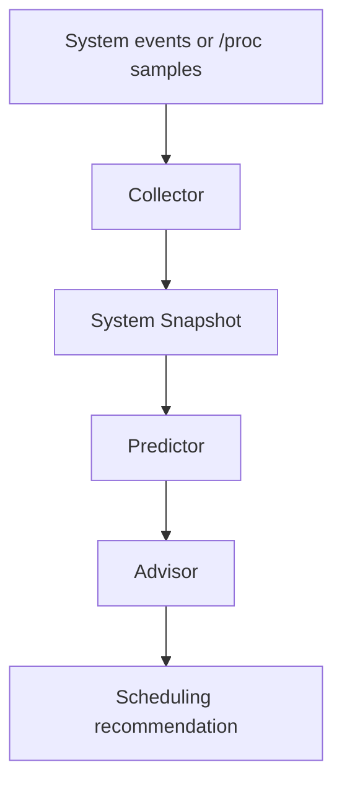

# CerebroX

CerebroX is a C++20 userspace operating-system intelligence layer that predicts workload behavior and recommends CPU scheduling actions in microseconds.

It is designed to demonstrate:

- low-latency event processing
- process-state tracking
- workload prediction
- scheduling recommendations
- benchmarkable decision latency
- Linux compatibility through `/proc`-style data collection with synthetic fallback on non-Linux hosts

## What it helps with

CerebroX helps users and engineers understand when a machine is about to become CPU-bound, memory-heavy, or latency-sensitive. Instead of reacting after a spike, it looks for trends and recommends actions such as protecting foreground tasks, boosting priority, pinning work to cores, or moving background jobs out of the way.

It is useful for:

- gaming laptops that stutter when background tasks spike
- video-call scenarios where foreground responsiveness matters
- server operators who want early warning before overload
- systems engineers who want a small, measurable low-latency decision engine

## Build

```bash
cmake -S . -B build
cmake --build build --config Release
```

## Run

```bash
./build/cerebrox demo
./build/cerebrox live
./build/cerebrox benchmark
```

## Demo output

The demo shows a dashboard with:

- process name and PID
- predicted workload class
- scheduling recommendation
- rationale for the recommendation
- benchmark-style decision latency

## Project flow



## Core idea

Modern systems usually react after pressure appears. CerebroX predicts workload changes earlier and reduces the time it takes to make a scheduling decision to microseconds on the local machine.

## Notes

- This is a userspace intelligence layer, not a kernel patch.
- It does not directly reimplement Linux CFS.
- It is a portfolio project that demonstrates the design of proactive scheduling intelligence.
