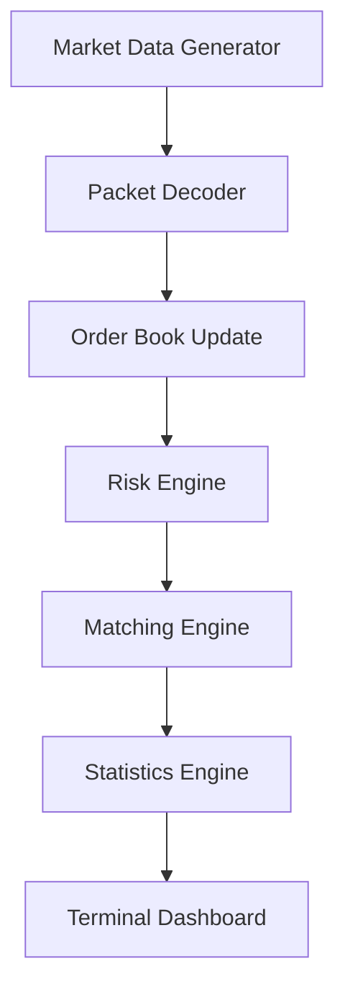

# Architecture

## Design Notes

- Single-threaded mode is deterministic and easy to reason about.
- The runtime can be extended with SPSC queues and worker threads for pipeline stages.
- Price levels are kept sorted to mirror exchange-style matching.
- The design leaves room for future DPDK, NUMA, and shared-memory integration.
