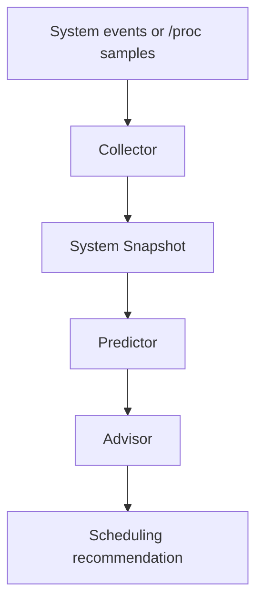
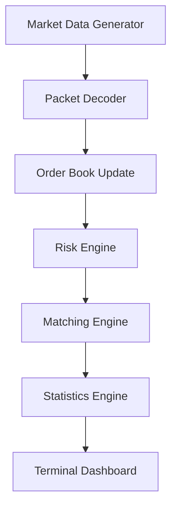

# CerebroX Architecture

## Flow

1. The collector ingests process samples from synthetic traces or Linux `/proc`-style data.
2. The system snapshot keeps a short history for each process.
3. The predictor classifies the workload and estimates the next CPU pressure.
4. The advisor turns the prediction into a scheduling recommendation.
5. The CLI renders the result as a terminal dashboard with microsecond-scale latency measurements.

## Design goal

CerebroX is a userspace intelligence layer. It does not replace the kernel scheduler. It demonstrates how a low-latency decision engine can predict workload spikes and produce proactive scheduling advice before the machine feels pressure.# Architecture

## Design Notes

- Single-threaded mode is deterministic and easy to reason about.
- The runtime can be extended with SPSC queues and worker threads for pipeline stages.
- Price levels are kept sorted to mirror exchange-style matching.
- The design leaves room for future DPDK, NUMA, and shared-memory integration.
